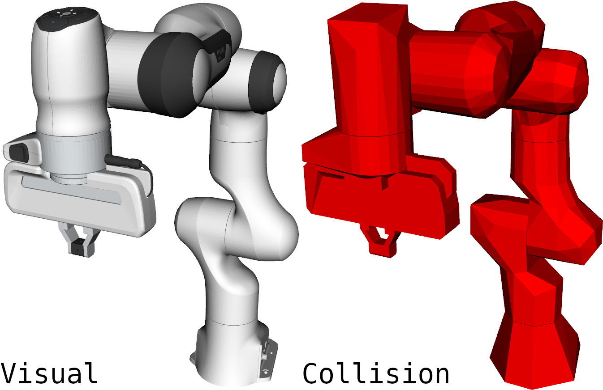

# fingrip_description

URDF and SDF description of Fingrip.

Here add picture of the fingrip model :

  

## Instructions

## Disclaimer [ TO UPDATE ]

## Directory Structure [ TO UPDATE ]

The following directory structure is utilised for this package because it provides
compatibility with CoppeliaSim, including [Fuel](https://app.gazebosim.org).

